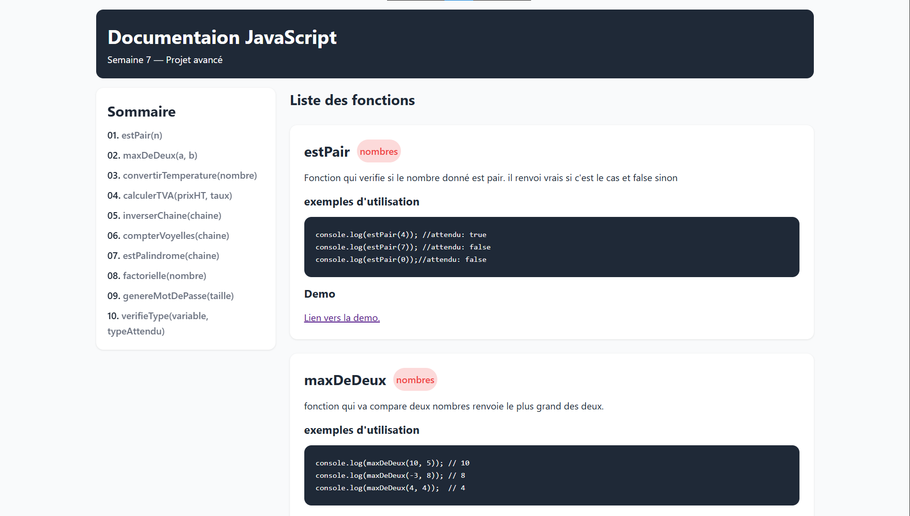

# proje73-utils-js

projet de fonctions utiles en JS avec une page html pour la documentation. un projet assez complet pour la prise en main des fonctions et de la logique algorithmique.

# Demonstrations


[Live Demo](https://yggdrasil2024.github.io/proje73-utils-js/)


# Fonctionnalités: 
## estPair
Fonction qui vérifie si le nombre donné est pair. il renvoi vrais si c'est le cas et false sinon. fais un usage simple de l'operateur modulo.
## maxDeDeux
fonction qui va compare deux nombres renvoie le plus grand des deux. une condition ternaire decide de la valeur à renvoyer.
## convertirTemperature
fonction qui permet qui prend en entrée la température en degré Celsius et
renvoie un résultats en degré Fahrenheit. la formule utilisée est `°F = (°C × 1,8) + 32`.
## calculerTVA
Fonction qui prend une chaine de caractère en entré et renvoie son inverse. la formule utilisé pour calculer se prix est `prixTTC = PrixHT(1 + taux)`.

## inverserChaine

fonction permettant de d'inverser une chaine de caractère. on commence par diviser la chaine inverser le tableau obtenu et ensuite reformer la chaine.

## CompterVoyelles

fonction qui prend une chaine de caractère en entrée et renvoie le nombre de
voyelles présentes dans la chaine. elle parcours la chaine et verifie si chaque position dans la chaine est une voyelle et ensuite incrementer un compteur quand c'est le cas.

## estPalindrome

fonction qui prend en entrée une chaine de caractère et vérifie que cette
chaine est oui non un palindrome. elle passe le mot en miniscule et verifie que le mot renversé est indentique au meme mot à l'endroit.

## factorielle

fonction calculant le factorielle d'un entier qu'elle prend en entrée.

## genereMotDePasse

fonction qui permet de générer un mot de passe en lui spécifiant la taille du
dit mot de passe. la fonction selectionne au hasard une position dans
une chaine contenant les caractères alpha numerique pour faire le mot de passe.

## verifieType

Fonction qui permet de verifier qu'un nombre est bien d'un certain type dont on
a besion.

# Technologie utilisée

- HTML: structure sémantique
- CSS: les feuille de style
- JS: pour la logique algorithmique

# arborescence du projet

```txt
root/
├── index.html          # Page d'accueil (Hero, Présentation, Valeurs)
├── style.css           # Feuille de style globale (Mobile & Desktop)
└── utils.js              # Script por la logique en javascript
```

## Obtenir le projet

N'hesiter surtout pas à recuperer le projet pour pouvoir le vous en inspirer ou y mettre un peu de votre creativité pour l'ameliorer;

1. Cloner le repo

```bash
git clone https://yggdrasil2024.github.io/proje73-utils-js.git
```

2. Accéder au dossier

```bash
cd proje73-utils-js
```
